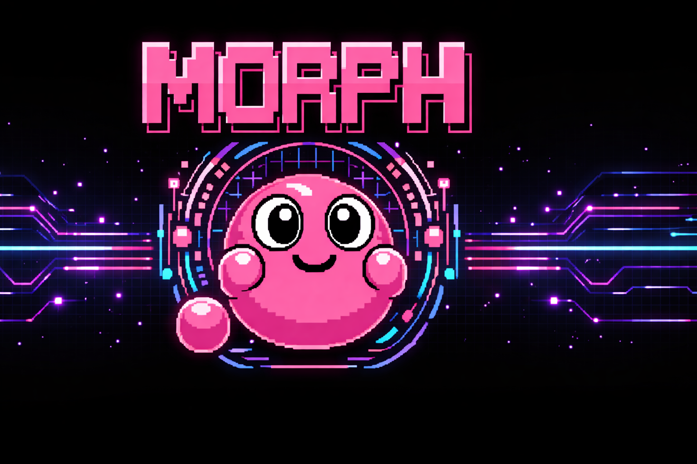

# Loopgate

**Last updated:** 2026-04-01 — primary product: policy-governed AI governance engine. See `docs/README.md`, `docs/roadmap/roadmap.md`, `docs/DOCUMENTATION_SCOPE.md`, and root `AGENTS.md`.



**Loopgate** is the enforcement and control plane for governed AI agent activity: capabilities, approvals, policy, sandboxing, secrets, audit, continuity memory, and **morphling** lifecycle. This repository implements the Loopgate server (`cmd/loopgate`, `internal/loopgate`) and shared libraries.

**Enterprise direction (primary engineering focus):** MCP server, transparent proxy mode, multi-tenant **`tenant_id`** isolation, and an admin console for IT governance — without weakening the same policy and audit rules as local HTTP handlers.

**Haven** (native Swift/macOS app, separate checkout e.g. `~/Dev/Haven`) is the **consumer demo** operator client. The in-repo **`cmd/haven/`** Wails shell is **reference-only** (tests, contracts); it is not the shipped product UI.

## What Loopgate is for

- Run a **local** control plane on a **Unix domain socket** (HTTP): signed sessions, capability tokens, approvals, deny-by-default policy.
- Execute filesystem and integration capabilities under explicit policy, with append-only audit.
- Govern **morphlings** (bounded subordinate workers), not self-authorizing agents.
- Preserve continuity and wake-state through Loopgate-owned memory artifacts — without treating raw chat as authority.

Natural language never creates authority. Model output is untrusted input.

## Quick Start (control plane)

```bash
go test ./...
go run ./cmd/loopgate
```

For the **Swift Haven** app, run Loopgate as above, then build and run **Haven** from its Xcode project.

### Legacy all-in-one script

`./start.sh` builds the in-repo Wails reference shell and launches it with Loopgate. Use only when you intentionally need that prototype; **product flows** use **`go run ./cmd/loopgate`** plus **Swift Haven**.

## Repository layout

- `cmd/loopgate/` — Loopgate control-plane service
- `cmd/haven/` — **Reference** Wails desktop (not the shipped Haven UI)
- `cmd/morphling-runner/` — lease-bound runner subprocess
- `internal/` — implementation packages
- `core/policy/` — checked-in policy and morphling class definitions
- `persona/` — persona config (operator-facing demos)
- `docs/` — architecture, RFCs, setup, **[Loopgate threat model](./docs/loopgate-threat-model.md)**
- `runtime/` — local state and logs (typically gitignored)

## Documentation

- [Docs index](./docs/README.md)
- [AMP (vendored)](./docs/AMP/README.md)
- [Documentation scope](./docs/DOCUMENTATION_SCOPE.md)
- [Setup](./docs/setup/SETUP.md)
- [Architecture](./docs/design_overview/architecture.md)
- [Loopgate](./docs/design_overview/loopgate.md)
- [Threat model](./docs/loopgate-threat-model.md)
- [Contributing](./CONTRIBUTING.md)
- [Security policy](./SECURITY.md)

## Status

Experimental; active security hardening. Not production-ready security software without your own review. Proprietary — see [LICENSE](./LICENSE).

## Repository hygiene

Runtime state, generated artifacts, and local editor config are excluded from source control (see `.gitignore` when present). Examples: `runtime/state/`, `runtime/logs/`, local memory artifacts under `core/memory/` where applicable, `output/`, `tmp/`.
