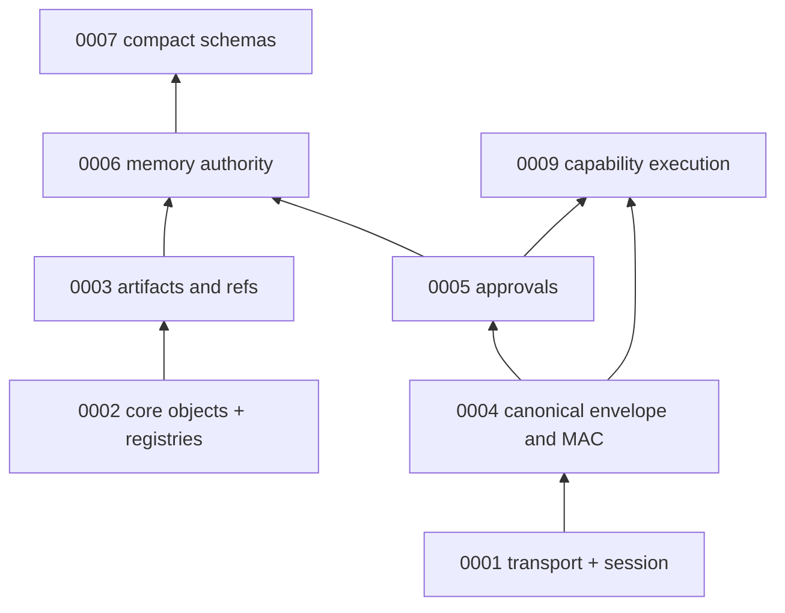

**Last updated:** 2026-03-25

# AMP (Authority Mediation Protocol)

AMP is a vendor-neutral protocol for mediating authority between
unprivileged AI agent clients and a privileged local control plane.

The core thesis: **authority is typed, explicit, and mediated -- never
inferred from natural language, references, or bearer possession
alone.**

AMP exists because AI agents need security boundaries that are
auditable, deterministic, and resistant to prompt injection, replay,
and privilege escalation. This spec is an attempt to define those
boundaries as a reusable recipe that anyone can implement.

## Who this is for

- **You want to build your own control plane** (your own "Loopgate")
  that governs what AI agents can do on a local machine. Read the
  RFCs and conformance checklist.
- **You want to build a client** (operator UI or IDE integration) that talks to an
  AMP-compliant control plane. Start with the quick-start guide below.
- **You want to understand the security model** before trusting an
  agent orchestrator. Read RFC 0001 (transport) and RFC 0004
  (integrity).

## Quick-start for implementers

If you want to build a working AMP client from scratch, read these
in order:

1. **[RFC 0001: Local Transport Profile](./AMP-RFCs/0001-local-transport-profile.md)**
   -- how to connect, establish a session, and recover from failures.
   Section 7 defines the session establishment handshake.
2. **[RFC 0004: Canonical Envelope and Integrity Binding](./AMP-RFCs/0004-canonical-envelope-and-integrity-binding.md)**
   -- how to sign every privileged request. Section 9 defines the exact
   byte serialization. Section 15 has test vectors you can verify
   against.
3. **[RFC 0009: Capability Execution Operation](./AMP-RFCs/0009-capability-execution-operation.md)**
   -- how to invoke a capability and handle the response.
4. **[RFC 0005: Approval Lifecycle](./AMP-RFCs/0005-approval-lifecycle-and-decision-binding.md)**
   -- how approval-gated execution works (read this when you need it).

If you want to build a control plane, also read:

5. **[RFC 0002: Core Object Model](./AMP-RFCs/0002-core-object-model.md)**
   -- the object vocabulary, denial code registry, and event type
   registry.
6. **[RFC 0003: Artifact and Reference Model](./AMP-RFCs/0003-artifact-and-reference-model.md)**
   -- how to handle quarantine, promotion, and lineage.
7. **[RFC 0006: Continuity and Memory Authority](./AMP-RFCs/0006-continuity-and-memory-authority.md)**
   -- how to govern agent memory without letting it become ambient
   authority.

Reference material:

- **[RFC 0007: Compact Schemas](./AMP-RFCs/0007-core-envelopes-and-compact-schemas.md)**
  -- copy-paste JSON shapes for common objects.
- **[RFC 0008: Open Issues](./AMP-RFCs/0008-open-issues-gaps-and-assumptions.md)**
  -- known gaps and challenged assumptions (non-normative).
- **[Test Vectors](./conformance/test-vectors-v1.md)** -- hex dumps
  and digests for verifying your canonical serializer.
- **[Conformance Checklist](./conformance/local-uds-v1-checklist.md)**
  -- checkbox list for claiming `local-uds-v1` alignment.

## Dependency graph

Normative rule: **RFC 0004 wins** over RFC 0001 if canonical integrity wording conflicts.

## Contents

- [AMP RFC 0001: Local Transport Profile](./AMP-RFCs/0001-local-transport-profile.md)
- [AMP RFC 0002: Core Object Model](./AMP-RFCs/0002-core-object-model.md)
- [AMP RFC 0003: Artifact and Reference Model](./AMP-RFCs/0003-artifact-and-reference-model.md)
- [AMP RFC 0004: Canonical Envelope and Integrity Binding](./AMP-RFCs/0004-canonical-envelope-and-integrity-binding.md)
- [AMP RFC 0005: Approval Lifecycle and Decision Binding](./AMP-RFCs/0005-approval-lifecycle-and-decision-binding.md)
- [AMP RFC 0006: Continuity and Memory Authority](./AMP-RFCs/0006-continuity-and-memory-authority.md)
- [AMP RFC 0007: Core Envelopes and Compact Schemas](./AMP-RFCs/0007-core-envelopes-and-compact-schemas.md)
- [AMP RFC 0008: Open issues, gaps, and assumptions](./AMP-RFCs/0008-open-issues-gaps-and-assumptions.md) (working analysis)
- [AMP RFC 0009: Capability Execution Operation](./AMP-RFCs/0009-capability-execution-operation.md)
- [AMP local-uds-v1 Conformance Checklist](./conformance/local-uds-v1-checklist.md)
- [Conformance test vectors v1](./conformance/test-vectors-v1.md) (hex + canonical JSON digests)

## Loopgate / product bridge documents

These documents are product-specific and not part of the neutral spec:

- [AMP Implementation Mapping](./design_overview/amp_implementation_mapping.md) (links into `internal/`)
- [Loopgate Token Policy](../rfcs/0001-loopgate-token-policy.md) -- must agree with AMP RFC 0004 on canonical request MAC

## Release gate (local-uds-v1)

Before tagging a release or claiming **"aligned with AMP local-uds-v1"**, complete [local-uds-v1-checklist](./conformance/local-uds-v1-checklist.md) or document **waivers** with RFC/issue links. RFC 0008 tracks known spec gaps that may block a full check.

## Scope boundary

- **Here (`docs/AMP/`):** neutral names, transport profile, object model, integrity, approvals, memory authority, capability execution (protocol intent).
- **Elsewhere in this repository:** Loopgate routes, **HTTP-on-UDS** setup (in-tree MCP deprecated — ADR 0010), the Haven TUI/CLI MVP, product RFCs, threat model, and the in-repo Wails reference under `cmd/haven/` (contract shell only).

## Contributing

AMP is designed to be implementable by anyone. If you find ambiguity,
missing edge cases, or places where you had to guess -- that is a spec
bug. File an issue or open a PR against the RFC that confused you.
