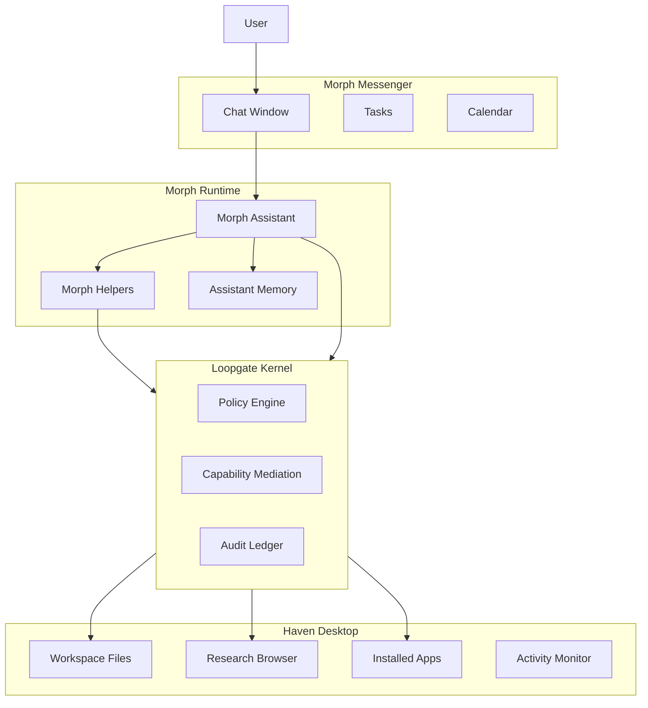

**Last updated:** 2026-03-24

# **Haven OS — Desktop Blueprint**

  

## **Concept**
  

Haven OS is a **secure habitat for AI assistants**. It provides a visible, governed environment where the assistant (Morph) can work safely inside a sandboxed workspace enforced by the Loopgate security kernel.

  
Design inspiration: **“a 1993 workstation discovered in 2100.”**

Retro workstation calmness + modern clarity + visible AI activity.

No neon cyberpunk. No clutter. Calm and trustworthy.

---

# **Global Layout**

Haven OS is a **windowed desktop environment** — multiple resizable windows on a spatial canvas, like classic Macintosh or NeXTSTEP. Not a tabbed interface.

```
+-------------------------------------------------------------+
| ◆ Haven │ File │ Edit │ View │ Window │ System    ● idle  10:23 |
|-------------------------------------------------------------|
|                                                             |
|  ┌─ Morph ──────────────┐   ┌─ Loopgate ─────────────┐     |
|  │ Thread sidebar │ Chat │   │ Pending Approvals      │     |
|  │                │      │   │ Capabilities           │     |
|  │                │      │   │ Policy                 │     |
|  └────────────────┴──────┘   └────────────────────────┘     |
|                                                    [avatar] |
|  📁 Workspace    📄 imported.py                             |
|  🔍 Activity                                                |
|-------------------------------------------------------------|
| [Morph] [Loopgate] [Workspace] │ ● Safe  Workers: 0/5 10:23|
+-------------------------------------------------------------+
```

Three primary zones:

- **Menubar** — Apple-style dropdown menus (File, Edit, View, Window, System) + Morph presence status + clock
- **Desktop** — Spatial canvas with app icons, file icons, Morph avatar, and resizable windows
- **Taskbar** — Open window buttons + security tray (status dot, approvals, workers, clock)

---

# **Haven Menubar**

Apple-style menu bar at the top:

```
◆ Haven │ File │ Edit │ View │ Window │ System     ● Morph is relaxing  10:23
```

- **File**: New Thread, Import File, Import Folder
- **Edit**: Undo, Cut, Copy, Paste (reserved)
- **View**: Arrange Windows, Settings
- **Window**: Morph, Loopgate, Workspace, Activity
- **System**: Morph status (disabled), Workers count (disabled), Settings

Menubar shows Morph's presence status (dot + personality text) and the clock.

---

# **Desktop Workspace**

This is Morph’s **primary working environment**.

Example directory layout:

```
Workspace
 ├── Projects
 ├── Research
 ├── Imports
 ├── Artifacts
 └── Memory
```

Users can:

• drag folders into **Imports**

• open files

• observe Morph reading/writing files

Morph operates inside this workspace by default.

Leaving the workspace requires approval.

---

# **Morph Window** — Implemented

The Morph window is the primary chat surface. Resizable, draggable, opens from desktop icon or Window menu.

### Layout

```
┌═ Morph ══════════════════════════════════════════════ □ × ┐
│ Sidebar           │ Chat Area                             │
│                   │                                       │
│ [+ New Thread]    │ ● Morph is relaxing                   │
│                   │───────────────────────────────────────│
│ Thread 1          │ YOU                                   │
│ Thread 2          │ Can you refactor this?                │
│ Thread 3          │                                       │
│                   │ MORPH                                 │
│                   │ Sure! I'll clean up the **imports**   │
│                   │ and extract a `helper()` function:    │
│                   │ ┌─────────────────────────────┐       │
│                   │ │ go                           │       │
│                   │ │ func helper() { ... }        │       │
│                   │ └─────────────────────────────┘       │
│                   │                                       │
│                   │ [Type a message...          ] [Send]  │
└───────────────────┴───────────────────────────────────────┘
```

### Implemented features

- Thread list sidebar (create, select, persist)
- Thread rename via right-click context menu
- Chat with Morph (send messages, receive replies, tool-use orchestration)
- **Markdown rendering** — code blocks (dark terminal), inline code, bold, italic
- macOS-style approval dialogs (centered modal with blur backdrop)
- Thinking indicator with cancel button
- Presence-driven status bar (personality text, not technical state)
- Drag-and-drop file import (approval modal before workspace copy)

---

# **Activity Window** — Implemented

Plain English activity log showing everything Morph has done, translated from raw orchestration events.

```
┌═ Activity ═══════════════════════════════════════ □ × ┐
│ ACTIVITY LOG                                          │
│───────────────────────────────────────────────────────│
│ ● Morph read a file                        2 min ago  │
│ ● Morph wrote to the workspace             5 min ago  │
│ ● Morph browsed the workspace             12 min ago  │
│ ○ You sent a message                      15 min ago  │
│ ● Morph replied                           15 min ago  │
└───────────────────────────────────────────────────────┘
```

### Implemented features

- Plain English event translation from thread JSONL files
- Relative timestamps ("2 min ago", "1 hr ago")
- Status dots: green (allowed), red (denied), amber (pending), gray (info)
- Click-to-expand detail panels showing raw event data
- Polls every 5 seconds when Activity window is open
- Up to 100 most recent entries from up to 10 recent threads

Users can **observe all Morph activity in plain English**.

---

# **Helper Visualization**


Morph helpers appear like temporary worker processes.

```
Worker Spawned
researcher-1
scope: internet_research
status: running
```

When finished:

```
researcher-1
status: complete
artifact created
```

Workers automatically terminate when tasks complete.

---

# **App System**


Haven supports installable **apps**.

Examples:

```
Researcher
Code Assistant
Browser
File Analyzer
Terminal
```

Apps represent:

**tool bundles + permission sets**.


Example install dialog:

```
Install App: Researcher

Permissions required:
✓ internet access
✓ document analysis
✓ helper workers

[Install]
```

---

# **Approval Prompts** — Implemented

macOS-style modal dialogs with blur backdrop. Clear, calm, and informative.

```
┌─────────────────────────────────────────────┐
│            [Loopgate Shield Icon]            │
│                                             │
│     Morph wants to save a file              │
│                                             │
│  This creates or modifies a file inside     │
│  Haven's workspace. Your real files won't   │
│  be touched.                                │
│                                             │
│  ▸ Show Details                             │
│                                             │
│                    [Deny]  [Allow]          │
└─────────────────────────────────────────────┘
```

Expanded details show capability name and Loopgate mediation info.

Also used for file import drops:
```
┌─────────────────────────────────────────────┐
│         [File Import Icon]                  │
│                                             │
│  Import file into Haven?                    │
│                                             │
│  This creates a copy in Haven's workspace.  │
│  Your originals won't be touched. Morph     │
│  will have full read/write access.          │
│                                             │
│  File: analysis.py                          │
│                                             │
│                   [Cancel]  [Import]        │
└─────────────────────────────────────────────┘
```

---

# **Loopgate Window** — Implemented

Security dashboard showing Loopgate state. Replaces the earlier tabbed "Security Center."

```
┌═ Loopgate ═══════════════════════════════════════ □ × ┐
│ PENDING APPROVALS                                      │
│ No pending approvals                                   │
│────────────────────────────────────────────────────────│
│ CAPABILITIES                                           │
│ ● fs_read      granted                                 │
│ ● fs_write     granted                                 │
│ ● fs_list      granted                                 │
│────────────────────────────────────────────────────────│
│ POLICY                                                 │
│ Read enabled            YES                            │
│ Write enabled           YES                            │
│ Write requires approval YES                            │
└────────────────────────────────────────────────────────┘
```

### Implemented features

- Pending approvals section with capability name, expiry, redaction indicator
- Capabilities list with granted/denied status dots
- Policy overview (read/write/approval settings)
- Auto-polling every 10 seconds when Loopgate window is open

Most users will not need to access this.

---

# **Haven Boot Experience** — Implemented

When Haven launches, a retro terminal boot sequence plays, followed by either the setup wizard (first run) or the desktop.

```
HAVEN OS v1.0
Initializing Loopgate kernel...
Loading workspace...
Starting Morph runtime...

System ready._
```

### Implemented features

- Dark background with CRT scanline overlay
- Monospace amber text with per-line staggered animation
- Blinking cursor after final line
- Smooth opacity fade-out transition to desktop (0.8s ease-out)
- On first run: transitions to setup wizard instead of desktop
- Desktop fades in after boot sequence completes (~1.8s total)

---

# **Color Palette** — Implemented

Retro workstation aesthetic, implemented as CSS custom properties in `App.css`.

| Role | Color | Token |
|------|-------|-------|
| Desktop background | blue-gray `#A8B8C8` | `--desktop` |
| Window chrome | bone `#E8E4DC` | `--chrome` |
| Menubar | cream `#F0EDE6` | `--menubar` |
| Window body | white `#FFFFFF` | `--win-body` |
| Panels | linen `#F2EFE9` | `--panel` |
| Cards | warm white `#FAF8F4` | `--card` |
| Primary text | near-black `#1C1B19` | `--text-1` |
| Secondary text | warm gray `#6B675F` | `--text-2` |
| System accent | steel blue `#4D7FA0` | `--blue` |
| Activity/attention | amber `#C8962E` | `--amber` |
| Success/safe | green `#4E8C5E` | `--green` |
| Warning/error | red `#B84A4A` | `--red` |

Typography:
- System chrome: `Space Mono` / `SF Mono` / `Menlo` / `Monaco` (monospace stack via `--font-sys`)
- Body content: `DM Sans` / `Lucida Grande` / system sans-serif (via `--font-body`)

Wallpapers: 9 themes (Sahara, Terracotta, Sandstone, Classic Blue, Sage, Slate, Lavender, Cloud, Midnight) each with base color, light gradient, center glow, and edge vignette.

Inspired by:

- Macintosh System 7
- NeXTSTEP
- Xerox PARC
- early UNIX workstations

---

# **Settings Window** — Implemented

Unified control panel for Haven preferences. Replaced the standalone wallpaper picker.

```
┌═ Settings ═══════════════════════════════════════ □ × ┐
│ IDENTITY                                              │
│ Assistant name                                        │
│ [  Morph                                         ]    │
│───────────────────────────────────────────────────────│
│ APPEARANCE                                            │
│ Desktop wallpaper                                     │
│ ┌──────┐ ┌──────┐ ┌──────┐                           │
│ │Sahara│ │Terra │ │Sand  │  ...                       │
│ └──────┘ └──────┘ └──────┘                            │
│───────────────────────────────────────────────────────│
│ BEHAVIOR                                              │
│ ☑ Enable idle behavior                               │
│ When idle, Morph will tidy the workspace,             │
│ write notes, and review memories.                     │
│───────────────────────────────────────────────────────│
│                                          [Save]       │
└───────────────────────────────────────────────────────┘
```

Settings persisted to `haven_preferences.json`. Changes applied in-memory immediately (name → presence, idle → idle manager).

---

# **Toast Notifications** — Implemented

Retro slide-in notifications from top-right corner. Used to surface idle behavior and system events.

```
                                    ┌─────────────────────┐
                                    │ Morph               │
                                    │ tidying up the      │
                                    │ workspace           │
                                    └─────────────────────┘
```

- Auto-dismiss after 5 seconds, click to dismiss early
- Variants: info (blue title), success (green), warning (amber)
- Currently triggered by idle behavior completion

---

# **Morph Desktop Avatar** — Implemented

Pixel-art SVG character on the desktop surface. Shows Morph's current state visually.

### States and animations

| State | Animation | Trigger |
|-------|-----------|---------|
| Idle | Gentle float (4s loop) + eye blink | Default state |
| Working | Quick bob (600ms loop) | Tool execution (fs_write, etc.) |
| Thinking | Head tilt (2s loop) | Model call in progress |
| Creating | Slight rock (1.2s loop) | Paint capabilities |
| Reading | Still, slight lean | fs_read, fs_list, browser |
| Sleeping | Slow drift, 70% opacity, closed eyes | 30min idle between 10pm-6am |
| Excited | Bounce (400ms, 3x) | Task completion (8s then → idle) |

Avatar is a 48x64 SVG with body, head, eyes, mouth, arms, feet, and antenna. Pure CSS animations, no sprite sheets.

---

# **Workspace Window** — Implemented

File manager for Haven's sandboxed workspace.

- Import toolbar (file + folder buttons)
- Breadcrumb navigation
- Root grid view (Projects, Imports, Artifacts, Research with emoji icons)
- File list view with sizes and export buttons
- Inline file preview (monospace, 8KB truncation)
- Unified diff view (dark terminal, colored add/remove lines, export from diff)
- "Review" button on imported/artifact files

---

# **Why This UX Works**

  

### **Visibility**


Users can see what the AI is doing.


### **Boundaries**

Workspace vs external system is clear.


### **Familiarity**


Desktop metaphor is widely understood.

---

# **System Layers**


User

→ Morph Messenger

→ Haven Desktop Environment (trusted client runtime)

→ Morph Runtime

→ Loopgate Kernel


This separation preserves usability while maintaining security guarantees.

**Important:** Haven is a **Loopgate client runtime**, not merely a passive UI. It runs the chat loop, calls the model, interprets tool requests, and invokes Loopgate for capability mediation. The architecture treats Haven as a trusted process that must authenticate to Loopgate and operate within its granted capability scope.

# Haven OS Architecture



---

## Code map (implementation)

The shipping Haven desktop shell is **Wails + React** under `cmd/haven/frontend/`.

- **[Haven_Frontend_Source_Map.md](./Haven_Frontend_Source_Map.md)** — `App.tsx` orchestration, `src/hooks/` subscriptions and polls, `HavenFloatingWindows`, and where to add new windows.
- **[HavenOS_Frontend_Structure.mmd](./HavenOS_Frontend_Structure.mmd)** — Mermaid layering (Go bindings ↔ hooks ↔ shell components).
- **`cmd/haven/frontend/README.md`** — build commands and directory conventions.