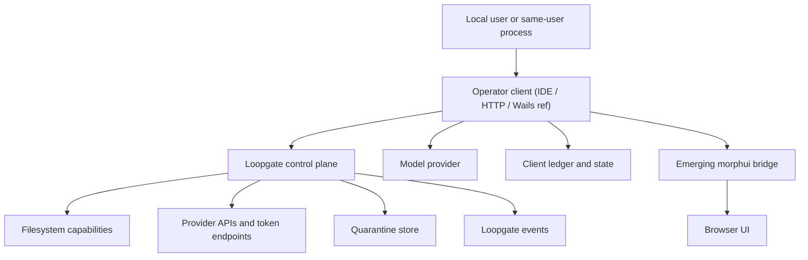

**Last updated:** 2026-04-14

# Loopgate Threat Model

**Threat model snapshot reviewed:** 2026-04-11. Re-validate after major transport, multi-tenant, Claude Code hooks, or **out-of-tree IDE bridge** surface changes. (**In-tree MCP removed** — ADR 0010 — reducing subprocess/protocol attack surface; a future thin MCP forwarder would re-open review.)

## Executive summary

The highest-risk themes in a typical **Loopgate** deployment are local control-plane abuse, audit and state integrity, and sensitive third-party data handling through Loopgate-managed provider connections. Implemented controls include peer-bound and signed Loopgate requests, explicit approval state, pending-approval decisions bound to the originating control session, typed and policy-gated capabilities, quarantined remote payloads, and OS-backed secure secret storage on macOS. Residual risks concentrate on same-user local abuse of the control plane (including **unauthenticated `GET /v1/health`** as a trivial liveness probe — by design), fail-open configuration defaults around filesystem scope, local integrity gaps in audit-derived memory, and any future browser or bridge bootstrap surface. Recent review did **not** find a live same-user peer-hop bypass in the current approval path or a delegated-session bootstrap bypass in the generic helper; the remaining gap is stronger launch-bound client identity and UI-channel provenance for any future browser bridge. Inventory routes **`GET /v1/status`** / **`GET /v1/connections/status`** require authenticated signed GETs; see [RFC 0001 — token policy](rfcs/0001-loopgate-token-policy.md). Evidence anchors: [server.go](../internal/loopgate/server.go), [client_credentials.go](../internal/loopgate/client_credentials.go), [pkce.go](../internal/loopgate/pkce.go), [quarantine.go](../internal/loopgate/quarantine.go), [claude_code_hooks_mvp.md](design_overview/claude_code_hooks_mvp.md), [0002-delegated-session-refresh.md](rfcs/0002-delegated-session-refresh.md).

**Product framing:** Loopgate is the primary product in this repository.
Operator clients are Claude Code hooks, direct local HTTP clients, and optional
out-of-tree MCP→HTTP forwarders over HTTP on the Unix socket. The old in-tree
continuity subsystem is no longer part of the active Loopgate runtime and is
being moved to a separate `continuity` repo.

## Scope and assumptions

- In scope:
  - **Operator clients** connecting over HTTP on the Loopgate Unix socket (IDE bridges, reference Wails shell, tests, custom integrators)
  - `cmd/loopgate`, `internal/loopgate`, and supporting packages for policy, tools, audit, and secrets
  - `internal/shell`, `internal/modelruntime`, `internal/model`, `internal/tools`, `internal/safety`, `internal/config`, `internal/ledger`, `internal/state`, `internal/secrets`
  - `docs/design_overview/claude_code_hooks_mvp.md`, `docs/rfcs/0002-delegated-session-refresh.md`, `core/policy/policy.yaml`
- Out of scope (this revision):
  - ancillary `cmd/` entrypoints outside principal surfaces, except as noted in abuse paths
  - tests as runtime surfaces, except where they demonstrate existing controls
  - **full** remote multi-tenant / admin-node deployment (planned enterprise direction — treat as not yet normative for this table)
  - third-party provider infrastructure outside what the code/config can express
- Explicit assumptions:
  - Same-user local processes remain in scope as realistic attackers.
  - The model does not assume the local user account is fully trusted simply because transport is local.
  - Loopgate-managed provider connections should be treated as capable of accessing production-sensitive third-party data.
  - **Primary integration direction** is **Claude Code hooks** plus **HTTP on the local socket** for direct clients and IDE integrations; any in-repo UI shell is a **reference** attachment, not the normative deployment story.
  - Any future browser or bridge path is an emerging surface, not the primary runtime path.
  - Continuity and memory concerns are now out of scope for the active Loopgate kernel and should be modeled separately in the `continuity` repo.
- Open questions that would materially change ranking:
  - Whether a dedicated launcher becomes the sole bootstrap for Loopgate and any future browser bridge, with stronger launch-bound identity than same-user local access.
  - Whether local audit/state files are intended to be forensic-grade evidence or operator convenience artifacts.

## System model

### Primary components

- **Operator client** (IDE, HTTP local client, or in-repo **Wails reference** under `cmd/haven/`):
  - handles prompt/model interaction, local state, and operator UX on the unprivileged side.
  - Evidence (reference path): [main.go](../cmd/haven/main.go), [chat.go](../cmd/haven/chat.go), [commands.go](../internal/shell/commands.go).
- **Loopgate** local control plane:
  - owns policy evaluation, approvals, capability execution, connection auth, provider token exchange, and UI-safe status/event APIs.
  - Evidence: [server.go](../internal/loopgate/server.go), [ui_server.go](../internal/loopgate/ui_server.go), [connections.go](../internal/loopgate/connections.go).
- Filesystem capability layer, provider-backed capability layer, secrets boundary, audit/state/memory, emerging `morphui` surface — see evidence paths in repository.

### Data flows and trust boundaries

- Local operator input → operator client
  - Data: natural-language prompts, slash commands, file paths, content, approval decisions.
  - Channel: local UI or IDE; shell-backed commands run in-process on the reference Wails backend where used.
  - Security guarantees: local session ownership only; no intrinsic authentication beyond OS session.
  - Validation/normalization: shell parsing, typed Loopgate request construction, secret redaction before local audit.
  - Evidence: [commands.go](../internal/shell/commands.go), [chat.go](../cmd/haven/chat.go), [main.go](../cmd/haven/main.go).
- Operator client → Loopgate
  - Data: session-open requests, capability executions, approval decisions, UI status/event polling, PKCE start/complete, connection validation.
  - Channel: HTTP over Unix socket.
  - Security guarantees: socket directory/file permissions, peer identity binding, signed request envelopes, request-size limits, strict JSON decoding.
  - Validation/normalization: `http.MaxBytesReader`, `DisallowUnknownFields`, capability normalization, signed-request verification, approval/nonce checks.
  - Evidence: [server.go](../internal/loopgate/server.go#L237), [server.go](../internal/loopgate/server.go#L1721), [client.go](../internal/loopgate/client.go).
- Loopgate → local filesystem
  - Data: repo paths, local file content, directory listings.
  - Channel: local filesystem syscalls.
  - Security guarantees: policy allow/deny, canonical path safety, descriptor-based traversal for current filesystem tool paths, approval gating for writes.
  - Validation/normalization: `SafePath`, per-operation policy checks, no-follow traversal/open logic.
  - Evidence: [safepath.go](../internal/safety/safepath.go), [checker.go](../internal/policy/checker.go), [path_open.go](../internal/tools/path_open.go).
- Loopgate → provider token endpoint / provider API
  - Data: client IDs, refresh tokens, client secrets, access tokens, structured API results, raw remote payloads.
  - Channel: outbound HTTPS by default, loopback HTTP exception for local dev.
  - Security guarantees: host allowlists, scheme validation, timeout-bound HTTP client, typed configured capabilities, secure secret resolution.
  - Validation/normalization: strict YAML config loading, allowed host checks, response-field allowlists, quarantine of raw responses.
  - Evidence: [integration_config.go](../internal/loopgate/integration_config.go), [client_credentials.go](../internal/loopgate/client_credentials.go), [pkce.go](../internal/loopgate/pkce.go), [quarantine.go](../internal/loopgate/quarantine.go).
- Operator client / model runtime → model provider
  - Data: compiled prompt, conversation history, tool descriptions, model API key reference.
  - Channel: HTTPS by default; localhost HTTP exception.
  - Security guarantees: validated base URL, timeout-bound client, env-backed secret reference.
  - Validation/normalization: runtime config validation, strict JSON handling, 2 MB response cap.
  - Evidence: [runtime.go](../internal/modelruntime/runtime.go), [provider.go](../internal/model/openai/provider.go), [compiler.go](../internal/prompt/compiler.go).
- **Prompt efficiency:** Model-facing payloads are kept compact where it does not weaken policy or auditability: bounded conversation windows, caps on tool output echoed into the chat loop, **Anthropic** ephemeral `cache_control` on stable system/tool blocks, **OpenAI-compatible** `prompt_cache_key` (plus automatic OpenAI prefix caching when supported), HTTP **429** backoff, and orchestration metrics for diagnosis. Full thread history may live in client thread stores; Loopgate wake-state stays authoritative for continuity. This is **not** a substitute for policy or for treating model output as untrusted.
- Operator client / Loopgate → local persistent artifacts
  - Data: JSONL ledger events, Loopgate audit events, runtime state, distillates, session keys, quarantined payloads.
  - Channel: local file append and atomic rename.
  - Security guarantees: `0600` file permissions for sensitive files, append-only ledger path, atomic temp-write+rename for state-like files, quarantine dir `0700`.
  - Validation/normalization: chain metadata, full prior-chain verification on append/bootstrap, canonical file paths, redacted audit metadata.
  - Gaps: hash chains are **tamper-evident within the file**, not **keyed proof of Loopgate authorship**; a same-user filesystem writer can replace a JSONL file with a new internally consistent chain. Malformed ledger content fails closed, but there is not yet signed checkpoints or remote append-only export in-tree. **Operator-facing detail:** [LEDGER_AND_AUDIT_INTEGRITY.md](setup/LEDGER_AND_AUDIT_INTEGRITY.md).
  - Evidence: [ledger.go](../internal/ledger/ledger.go), [state.go](../internal/state/state.go), [distillate.go](../internal/memory/distillate.go), [quarantine.go](../internal/loopgate/quarantine.go).
- Operator client → future `morphui` bridge/browser
  - Data: delegated Loopgate credentials, display-safe UI events, approval decisions.
  - Channel: planned launch-bound local channel plus browser HTTP.
  - Security guarantees: documented fail-closed delegated-session contract and UI no-authority rules.
  - Gaps: bridge launch/bootstrap, browser session handling, and launch-token race resistance are not yet implemented in this repo.
  - Evidence: [claude_code_hooks_mvp.md](design_overview/claude_code_hooks_mvp.md), [0002-delegated-session-refresh.md](rfcs/0002-delegated-session-refresh.md).

#### Diagram

## Assets and security objectives

| Asset | Why it matters | Security objective (C/I/A) |
| --- | --- | --- |
| Loopgate control-plane authority | Prevents untrusted model/UI/input paths from executing privileged actions directly | I |
| Provider credentials and refresh tokens | Grant access to third-party systems that may hold production-sensitive data | C |
| Provider access tokens in memory | Short-lived but still sufficient for third-party data access or action execution | C |
| Quarantined remote payloads | May contain production-sensitive third-party data that must not enter prompt/memory paths | C/I |
| Repo working tree and local files | Primary read/write target of filesystem capabilities | C/I |
| Approval workflow and operator intent | Protects write and other approval-gated actions from silent execution | I |
| Client ledger and Loopgate events | Core audit record for security-relevant outcomes and operator review | I/A |
| Runtime state and distillation cursor | Controls monotonic session progression and derived memory flow | I/A |
| Distillates and session keys | Influence future reasoning and local memory continuity | C/I |
| Delegated UI credentials for `morphui` | Would grant access to Loopgate UI APIs and approval actions if exposed | C/I |

## Attacker model

### Capabilities

- Same-user local processes can attempt to connect to local Unix sockets, observe local stdout/stderr, read world-readable runtime directories, and exploit bootstrap or browser-local races.
- Attackers can supply malicious prompts, repository content, config files, and environment values that **operator clients** or Loopgate will parse and validate.
- Attackers can attempt local request forgery against browser/bridge surfaces once those are introduced.
- Attackers can abuse provider-backed capabilities to reach production-sensitive third-party data if controls allow it.
- Attackers with same-user filesystem access can tamper with local runtime artifacts unless integrity controls make that visible.

### Non-capabilities

- There is no current remote internet-facing Loopgate API in this repo; Loopgate listens on a Unix socket by default, not a public TCP port.
- There is no generic shell tool or generic raw HTTP tool exposed to the model/runtime surface.
- **Unprivileged clients** do not receive provider credentials, refresh tokens, or raw access tokens through the implemented Loopgate control-plane contracts.
- The `morphui` browser bridge is not yet the primary runtime path and is only an emerging surface in repo docs/RFCs, not a fully shipped implementation here.

## Entry points and attack surfaces

| Surface | How reached | Trust boundary | Notes | Evidence (repo path / symbol) |
| --- | --- | --- | --- | --- |
| `GET /v1/health` | Any same-user socket client | Local process -> Loopgate | Liveness (`version`, `ok`) only — no policy/capability inventory | [server_connection_handlers.go](../internal/loopgate/server_connection_handlers.go) |
| `GET /v1/status`, `GET /v1/connections/status` | Bearer + signed request | Local process -> Loopgate | Full status / connection summaries require **session + HMAC** (see [RFC 0001](rfcs/0001-loopgate-token-policy.md)) | [server_connection_handlers.go](../internal/loopgate/server_connection_handlers.go) |
| `/v1/session/open` | Same-user socket client | Local process -> Loopgate | Session/bootstrap path for capability and approval tokens | [server.go](../internal/loopgate/server.go) `handleSessionOpen` |
| `/v1/capabilities/execute` | Signed request + capability token | Local process -> Loopgate -> filesystem/provider path | Main privileged execution surface | [server.go](../internal/loopgate/server.go) `handleCapabilityExecute` |
| `/v1/approvals/{id}/decision` | Signed request + approval token | Local process -> approval state | Direct approval path outside UI feed | [server.go](../internal/loopgate/server.go) `handleApprovalDecision` |
| `/v1/ui/status`, `/v1/ui/events`, `/v1/ui/approvals`, `/v1/ui/approvals/{id}/decision` | Signed UI client | Loopgate -> future UI/bridge surface | Display-safe UI APIs and approval surface | [ui_server.go](../internal/loopgate/ui_server.go) |
| PKCE start/complete endpoints | Operator flow or future UI path | Local process -> Loopgate -> provider OAuth flow | Bootstrap for refresh-token storage and access-token issuance | [pkce.go](../internal/loopgate/pkce.go) |
| YAML connection definitions | Repo config | Repo content -> Loopgate trusted config | Controls provider hosts, grant type, capability path, response fields | [integration_config.go](../internal/loopgate/integration_config.go) |
| Model runtime config and env refs | Runtime config / environment | Operator/env -> model runtime | Controls outbound model base URL and API-key ref | [runtime.go](../internal/modelruntime/runtime.go) |
| Slash commands and model tool-call parsing | Local user / model output | Untrusted content -> client -> Loopgate | Operator command and tool-intent surface | [commands.go](../internal/shell/commands.go), [parser.go](../internal/orchestrator/parser.go) |
| Audit/state/quarantine files | Local filesystem | Runtime -> persistent local artifacts | Same-user tampering target if integrity protections are weak | [ledger.go](../internal/ledger/ledger.go), [quarantine.go](../internal/loopgate/quarantine.go) |

## Top abuse paths

1. Same-user local process abuses Loopgate session/bootstrap
   1. Attacker connects to `runtime/state/loopgate.sock`.
   2. It attempts to open a session or reuse delegated/UI credentials.
   3. It issues capability or approval requests as if it were the intended client.
   4. Impact: trusted local control-plane misuse, including read/write actions and approval interference.
2. Provider-backed capability exfiltrates sensitive third-party data into local operator surfaces
   1. Operator configures a real provider connection with production-sensitive access.
   2. Attacker influences prompts or operator actions to invoke an allowed typed capability.
   3. Structured fields are returned to the client/UI while raw payload remains quarantined.
   4. Impact: production-sensitive data can still cross into local display/audit paths if allowed fields are too broad.
3. PKCE/browser/bootstrap interception against emerging `morphui` surface
   1. Same-user local process races for launch/bootstrap material or inspects stdout/local browser launch state.
   2. It steals or replays delegated Loopgate credentials or a one-time launch token.
   3. It reads UI feeds or submits approval decisions through the bridge/browser path.
   4. Impact: UI-only approval and status surfaces can be hijacked without direct socket use.
4. Repo policy or connection config broadens trusted scope
   1. Malicious or mistaken repo change edits `core/policy/policy.yaml` or `loopgate/connections/*.yaml`.
   2. Loopgate accepts the config because it is syntactically valid.
   3. Filesystem roots, provider destinations, or redirect behavior become broader than intended.
   4. Impact: capability scope or third-party data reach expands silently.
5. Local audit/state tampering weakens forensic trust
   1. Same-user attacker edits local ledger, Loopgate events, distillates, or runtime state on disk.
   2. Distillation skips malformed lines instead of surfacing a hard integrity event.
   3. Incident review sees partial or misleading history.
   4. Impact: security-relevant provenance becomes unreliable.
6. Quarantine boundary erosion through future UI rendering or operator inspection shortcuts
   1. Raw remote payload is stored in Loopgate quarantine.
   2. Future UI/bridge code mistakenly renders or forwards quarantined content.
   3. Untrusted or sensitive provider payload becomes prompt-eligible, memory-eligible, or browser-visible.
   4. Impact: prompt injection, sensitive-data leakage, or browser-side abuse.

## Threat model table

| Threat ID | Threat source | Prerequisites | Threat action | Impact | Impacted assets | Existing controls (evidence) | Gaps | Recommended mitigations | Detection ideas | Likelihood | Impact severity | Priority |
| --- | --- | --- | --- | --- | --- | --- | --- | --- | --- | --- | --- | --- |
| TM-01 | Same-user local process | Reachability to Loopgate socket or delegated UI credentials | Abuse local session/bootstrap path to execute or approve privileged actions | Trusted local control-plane misuse, operator intent bypass | Loopgate authority, approvals, repo files, provider-backed capabilities | Peer-bound sessions, signed requests, nonce replay checks, pending-approval decisions bound to the originating control session, approval state machine ([server.go](../internal/loopgate/server.go), [0001-loopgate-token-policy.md](rfcs/0001-loopgate-token-policy.md)) | Same-user local processes remain in scope; launch-bound bootstrap is not yet stronger than local same-user trust | Stronger **launcher-bound** bootstrap identity, tighten delegated credential handling, bind approval provenance to active UI channel | Alert on unexpected concurrent clients, repeated session opens, approval decisions without expected UI lineage | High | High | High |
| TM-02 | Malicious prompt, repo content, or operator action | Allowed typed provider capability and sensitive provider connection | Invoke provider-backed capability to retrieve production-sensitive structured data | Third-party data exposure into local display/audit surfaces | Provider-backed data, local audit, operator UI | Typed configured capabilities, allowed-host validation, response-field allowlists, quarantine of raw body ([integration_config.go](../internal/loopgate/integration_config.go), [client_credentials.go](../internal/loopgate/client_credentials.go), [quarantine.go](../internal/loopgate/quarantine.go)) | Structured field allowlists may still include sensitive fields if config is too broad | Provider-specific safe output schemas, reviewable capability manifests | Log provider, capability, field count, and quarantine refs | Medium | High | High |
| TM-03 | Same-user local process / emerging browser-local attacker | Future browser or bridge bootstrap becomes available | Race or intercept bridge bootstrap / delegated credentials / browser session establishment | UI feed exposure or approval misuse through browser path | Delegated UI credentials, approvals, UI event stream | Current harness boundary note + delegated-session RFC fail-closed ([claude_code_hooks_mvp.md](design_overview/claude_code_hooks_mvp.md), [0002-delegated-session-refresh.md](rfcs/0002-delegated-session-refresh.md)) | Browser/bridge bootstrap not fully implemented in code | Launch-bound bootstrap, one-time token exchange, strict browser session handling | Log bridge bootstrap attempts and delegated-session refresh failures | Medium | High | High |
| TM-04 | Malicious or mistaken repo/operator config | Ability to edit policy or connection YAML | Broaden allowed roots, destinations, redirect policy, or capability schemas | Expansion of trusted read/write or provider reach | Filesystem scope, provider connections, auth flow integrity | Strict YAML decoding, detached Ed25519 policy signatures, host allowlists, path/query validation, deny-by-default policy ([policy.go](../internal/config/policy.go), [integration_config.go](../internal/loopgate/integration_config.go), [checker.go](../internal/policy/checker.go)) | Explicit signed config can still broaden real scope if the operator signs an unsafe change | Reviewable signed-policy workflow and tighter shell/tool policy layers for less-trusted repos | Warn on broad roots or unusual redirect schemes at startup | Medium | High | High |
| TM-05 | Same-user local process with filesystem access | Access to runtime/audit files | Tamper with ledger, Loopgate events, state, distillates, or quarantine records | Audit and derived-memory integrity degradation | Ledger, Loopgate telemetry, distillates, runtime state | Append-only ledger, chained metadata, prior-chain verification, atomic rename, quarantine permissions ([ledger.go](../internal/ledger/ledger.go), [state.go](../internal/state/state.go), [quarantine.go](../internal/loopgate/quarantine.go), [distillate.go](../internal/memory/distillate.go)) | No external tamper evidence; corruption can become availability issue | Stronger checkpointing/signing if forensic trust required | Startup integrity checks, malformed-line counters | High | Medium | Medium |
| TM-06 | Malicious prompt or repo content | Model runtime enabled and tool-call parsing active | Induce tool-call generation, read sensitive local data, or spam approval workflows | Read amplification, approval fatigue, local sensitive-data exposure within allowed scope | Repo files, operator attention, prompt integrity | Untrusted model output, typed capability path, approval gating ([parser.go](../internal/orchestrator/parser.go), [render.go](../internal/loopgateresult/render.go), [server.go](../internal/loopgate/server.go)) | Freeform tag-based tool-call protocol | Stricter structured tool-call contracts, file-sensitivity policy on reads | Track repeated model-emitted reads/writes and approval churn | Medium | Medium | Medium |

## Mitigations and recommendations

### Highest-priority fixes

- Keep quarantine semantics strict (not prompt-eligible, not memory-eligible, not auto-rendered in browser or UI; access requires explicit operator intent). Evidence: [quarantine.go](../internal/loopgate/quarantine.go), [claude_code_hooks_mvp.md](design_overview/claude_code_hooks_mvp.md).

### Near-term control-plane work

- Strengthen launch-bound local identity for Loopgate and any future browser bootstrap.
- Add richer connection rotation metadata and explicit lifecycle telemetry for provider secrets.
- Continue runtime file/socket permission sweep across state, config, quarantine, and future bridge artifacts.
- As the **admin console**, **`tenant_id`**, Haven-side workflows, and **documented out-of-tree IDE bridges** (including any future **thin MCP forwarder** introduced by ADR) land, extend this document with explicit trust boundaries for those surfaces (fail-closed policy parity with HTTP handlers per `AGENTS.md`).

## Focus paths for manual security review

- [server.go](../internal/loopgate/server.go), [ui_server.go](../internal/loopgate/ui_server.go), [connections.go](../internal/loopgate/connections.go), [client_credentials.go](../internal/loopgate/client_credentials.go), [pkce.go](../internal/loopgate/pkce.go), [integration_config.go](../internal/loopgate/integration_config.go), [quarantine.go](../internal/loopgate/quarantine.go), [policy.go](../internal/config/policy.go), [distillate.go](../internal/memory/distillate.go), [state.go](../internal/state/state.go), [claude_code_hooks_mvp.md](design_overview/claude_code_hooks_mvp.md), [0002-delegated-session-refresh.md](rfcs/0002-delegated-session-refresh.md).

For the narrower question of which Claude-facing events are actual authority
surfaces versus observability-only hook events, see
[Claude Code authority surfaces threat model](design_overview/claude_code_authority_surfaces_threat_model.md).

## Quality check

- Loopgate session, capability, approval, connection, and UI endpoints covered.
- Trust boundaries include local user/process → operator client → Loopgate → filesystem/providers/persistence → emerging bridge.
- **Wails** path under `cmd/haven/` labeled reference-only; HTTP-on-socket clients and Haven are the primary integration direction.
- Enterprise integration surfaces flagged for future threat-model expansion as implemented.
