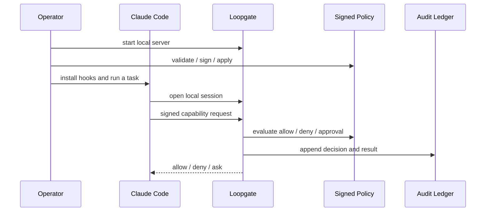

**Last updated:** 2026-04-15

# Getting Started

This is the shortest path to a real local Loopgate setup.

It assumes the current supported product shape:
- local-first
- single-user / local operator
- Claude Code hooks as the active harness
- signed policy
- local authoritative audit

## What you will do

1. validate the checkout
2. start Loopgate
3. validate and sign policy
4. install Claude Code hooks
5. run a normal task and inspect the local audit if needed

## Quick path

### 1. Validate the checkout

```bash
go mod tidy
go test ./...
```

### 2. Start Loopgate

```bash
go run ./cmd/loopgate
```

Default socket:

```text
runtime/state/loopgate.sock
```

Leave Loopgate running in its own terminal.

### 3. Validate and sign policy

In another terminal:

```bash
go run ./cmd/loopgate-policy-admin validate
go run ./cmd/loopgate-policy-sign -verify-setup
```

If Loopgate is already running and you changed policy:

```bash
go run ./cmd/loopgate-policy-admin apply -verify-setup
```

### 4. Install Claude Code hooks

```bash
go run ./cmd/loopgate install-hooks
```

This updates:
- `~/.claude/settings.json`
- `~/.claude/hooks/`

### 5. Run a normal task

Use Claude Code normally and watch for:
- low-risk reads that should be allow + audit
- higher-risk actions that should require approval
- hard denials that indicate policy or path issues

If you need quick visibility:

```bash
go run ./cmd/loopgate-ledger tail -verbose
go run ./cmd/loopgate-doctor report
```

## Normal local flow



## When things look wrong

- Hooks seem missing:
  - rerun `go run ./cmd/loopgate install-hooks`
- Policy changes are not taking effect:
  - rerun `validate`, `-verify-setup`, and `apply -verify-setup`
- A task was denied and you want to know why:
  - `go run ./cmd/loopgate-ledger tail -verbose`
- You want a structured local diagnostic snapshot:
  - `go run ./cmd/loopgate-doctor report`

## Read next

- [Setup](./SETUP.md)
- [Operator guide](./OPERATOR_GUIDE.md)
- [Doctor and ledger tools](./DOCTOR_AND_LEDGER.md)
- [Loopgate HTTP API for local clients](./LOOPGATE_HTTP_API_FOR_LOCAL_CLIENTS.md)
