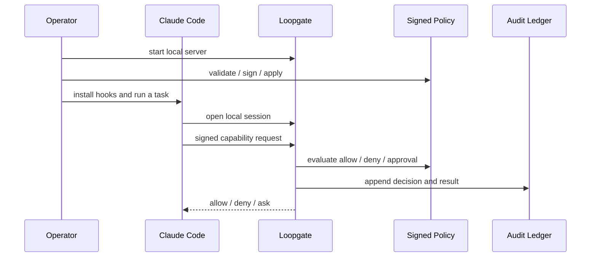

**Last updated:** 2026-04-20

# Getting Started

This is the shortest path to a real local Loopgate setup.

It assumes the current supported product shape:
- local-first
- single-user / local operator
- Claude Code hooks as the active harness
- signed policy
- local authoritative audit

## What you will do

1. install Loopgate
2. run the guided setup wizard
3. verify Loopgate is running
4. run a normal task and inspect the local audit if needed

Prerequisites:
- Python 3 on `PATH`
- Claude Code
- macOS for the current published install path

If you prefer a source checkout, you also need:
- Go 1.25 or newer

## Quick path

### 1. Fastest path

```bash
curl -fsSL https://raw.githubusercontent.com/loop-root/loopgate/main/scripts/install.sh | sh

loopgate setup
loopgate status
loopgate test
```

That installs the latest published macOS release under
`~/.local/share/loopgate/<version>` and installs wrapper commands under
`~/.local/bin`.

If you prefer a source checkout, the fastest source-first path is still:

```bash
make quickstart
```

`make quickstart` builds the local binaries and runs `./bin/loopgate quickstart`,
which accepts the recommended defaults without prompts:
- starter profile: `balanced`
- Claude Code hooks installed into `~/.claude/`
- macOS LaunchAgent installed and loaded so Loopgate stays up in the background

If you want to choose the profile or skip individual setup steps, use the guided
path below instead.

### 2. Guided source path: build local binaries

```bash
make build
# optional: copy the binaries into ~/.local/bin
make install-local
```

If you ran `make install-local`, replace `./bin/...` below with the bare
command names such as `loopgate`, `loopgate-ledger`, and
`loopgate-policy-admin`.

### 3. Guided setup: run the setup wizard

Installed-binary path:

```bash
loopgate setup
```

Source-checkout path:

```bash
./bin/loopgate setup
```

`loopgate setup` is the shortest supported operator path. It guides you through:
- local policy-signing setup
- choosing a starter policy profile: `balanced`, `strict`, or `read-only`
- reviewing the setup plan before local state is changed
- signing the selected policy
- checking for `python3` before Claude hook install
- installing Claude Code hooks
- optionally installing and loading a macOS LaunchAgent so Loopgate keeps running in the background
- printing the selected profile, signer `key_id`, policy paths, socket path, audit ledger path, and next commands at the end

Recommended default:
- `balanced`
  - Claude `Read`, `Glob`, `Grep`, `Edit`, and `MultiEdit` are allowed inside the repo root
  - Claude `Write` and allowed Bash commands still require approval
  - HTTP stays disabled

Higher-sensitivity option:
- `strict`
  - Claude reads and search stay allowed inside the repo root
  - all Claude file edits require approval
  - Bash and HTTP stay disabled

Low-friction evaluation option:
- `read-only`
  - Claude `Read`, `Glob`, and `Grep` are allowed inside the repo root
  - Claude `Write`, `Edit`, and `MultiEdit` stay disabled
  - Bash and HTTP stay disabled

If you need the broader `developer` template, render it manually with
`./bin/loopgate-policy-admin render-template -preset developer` and review it
before signing. That template is treated as experimental and is not part of the
supported first-run setup path.

Important:
- hook install writes into your user-level Claude config under `~/.claude/`
- until you remove those hooks, Claude Code will keep sending governed hook events through Loopgate across projects on this machine

If you prefer the manual path, see [SETUP.md](./SETUP.md).

### 4. Verify Loopgate is running

If setup loaded the macOS LaunchAgent, Loopgate should already be running in the
background. Verify with:

```bash
loopgate status
loopgate test
loopgate-doctor report
```

Source-checkout equivalents:

```bash
./bin/loopgate status
./bin/loopgate test
./bin/loopgate-doctor report
```

Use `loopgate status` as the quick operator summary and `loopgate-doctor report`
for deeper derived diagnostics. `status` now calls out the current
`operator_mode`, `daemon_mode`, `launch_agent_state`, and Claude hook state
directly, so you can tell at a glance whether Loopgate looks offline,
LaunchAgent-managed, or manually started.

If you skipped the LaunchAgent, start Loopgate yourself:

Foreground:

```bash
./bin/loopgate
```

Recommended macOS background path:

```bash
./bin/loopgate install-launch-agent -load
```

This LaunchAgent pins the current Loopgate executable path, so use the built
`./bin/loopgate` or an installed `loopgate` binary rather than `go run`.

Simple shell-managed background run from the repo root:

```bash
mkdir -p runtime/logs runtime/state
nohup ./bin/loopgate > runtime/logs/loopgate.stdout.log 2> runtime/logs/loopgate.stderr.log < /dev/null &
echo $! > runtime/state/loopgate.pid
```

Default socket:

```text
runtime/state/loopgate.sock
```

If you start Loopgate in the foreground from a terminal, that terminal session
owns the process. Closing the terminal usually stops Loopgate. Use `nohup`,
`launchctl`, or another service manager if you want it to stay up after the
shell exits.

Stop the `nohup` background process with:

```bash
kill "$(cat runtime/state/loopgate.pid)"
```

On the first successful start, Loopgate also bootstraps the default
Keychain-backed audit HMAC checkpoint key used for keyed audit-integrity
checkpoints on the local ledger.
If macOS Keychain access is denied or canceled, Loopgate fails closed at
startup rather than falling back to plaintext or unaudited mode. Rerun from an
interactive login session and approve the Keychain prompt.
For keychain-backed operator flows, prefer the stable `./bin/...` binaries over
`go run`; a fresh `go run` build changes the executable identity and can cause
repeated macOS approval prompts.

Setup normally installs Claude Code hooks for you. If you skipped that step,
you can run it manually later:

```bash
loopgate install-hooks
```

Source-checkout equivalent:

```bash
./bin/loopgate install-hooks
```

Quick smoke check after hook install:
- run `/hooks` inside Claude Code and confirm the 7 Loopgate hook events are registered
- verify the installed commands point at `~/.claude/hooks/loopgate_*.py`

If you later want to remove the integration again:

```bash
loopgate uninstall
loopgate uninstall --purge
```

Source-checkout equivalent:

```bash
./bin/loopgate uninstall
./bin/loopgate uninstall --purge
```

That removes Loopgate-managed Claude hook entries, removes the copied Loopgate
hook scripts, and on macOS unloads/removes the per-repo LaunchAgent.
Use `--purge` when you also want to remove repo-scoped runtime state, current
signer material, and default installed binaries. Tracked policy files remain in
the repo either way, so deleting a source checkout is still an explicit manual
step. On a published install, `--purge` also removes the managed install root.
The uninstall output includes a compact `offboarding_state` summary so the
remaining cleanup posture is easy to scan.

### 5. Run a normal task

Use Claude Code normally and watch for:
- low-risk reads that should be allow + audit
- higher-risk actions that should require approval
- hard denials that indicate policy or path issues

If you need quick visibility:

```bash
loopgate status
loopgate test
loopgate-ledger tail -verbose
loopgate-doctor report
```

Source-checkout equivalents:

```bash
./bin/loopgate status
./bin/loopgate test
./bin/loopgate-ledger tail -verbose
./bin/loopgate-doctor report
```

If a specific approval was denied and you have its id, explain that outcome
from the verified ledger with:

```bash
./bin/loopgate-doctor explain-denial -approval-id <approval-id>
```

If you instead have a direct `request_id` for a capability denial or execution
failure, use:

```bash
./bin/loopgate-doctor explain-denial -request-id <request-id>
```

If the block happened earlier in the Claude hook path and never became an
approval or capability request, use the Claude hook session and tool use id:

```bash
./bin/loopgate-doctor explain-denial -hook-session-id <session-id> -tool-use-id <tool-use-id>
```

## Did it work?

Use one real governed path instead of guessing from startup text alone:

1. run `/hooks` inside Claude Code and confirm the 7 Loopgate hook entries are present
2. ask Claude Code to read `README.md`
3. run:

```bash
./bin/loopgate-ledger tail -verbose
```

Expected result:
- you should see a recent `hook.pre_validate` event
- if the action was denied or approval-gated, that should also be visible in the tail output
- if nothing new appears, the first thing to re-check is whether the Claude hooks are installed and pointing at `~/.claude/hooks/loopgate_*.py`

## Optional contributor checkout validation

If you are validating a fresh source checkout rather than just installing
Loopgate for local use, also run:

```bash
go test ./...
```

## Normal local flow



## When things look wrong

- Hooks seem missing:
  - rerun `./bin/loopgate install-hooks`
  - confirm the tracked source bundle exists under `claude/hooks/scripts/`
- You want the supported background path on macOS:
  - run `./bin/loopgate install-launch-agent -load`
- Policy changes are not taking effect:
  - rerun `validate`, `-verify-setup`, and `apply -verify-setup`
  - `-verify-setup` uses the current signed policy `key_id` by default
  - pass `-key-id` only if you intentionally want to verify or apply against a different signer than the current `core/policy/policy.yaml.sig`
- A task was denied and you want to know why:
  - `./bin/loopgate-ledger tail -verbose`
- You want a structured local diagnostic snapshot:
  - `./bin/loopgate-doctor report`

## Read next

- [Setup](./SETUP.md)
- [Operator guide](./OPERATOR_GUIDE.md)
- [Policy reference](./POLICY_REFERENCE.md)
- [Glossary](./GLOSSARY.md)
- [Doctor and ledger tools](./DOCTOR_AND_LEDGER.md)
- [Loopgate HTTP API for local clients](./LOOPGATE_HTTP_API_FOR_LOCAL_CLIENTS.md)
