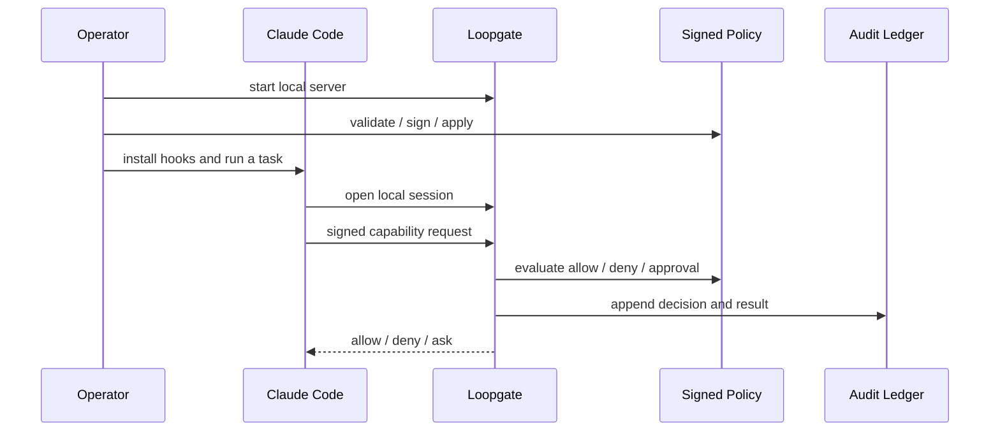

**Last updated:** 2026-04-16

# Getting Started

This is the shortest path to a real local Loopgate setup.

It assumes the current supported product shape:
- local-first
- single-user / local operator
- Claude Code hooks as the active harness
- signed policy
- local authoritative audit

## What you will do

1. validate the checkout
2. initialize local policy signing
3. start Loopgate
4. install Claude Code hooks
5. run a normal task and inspect the local audit if needed

## Quick path

### 1. Validate the checkout

```bash
go mod tidy
go test ./...
```

### 2. Initialize local policy signing

```bash
go run ./cmd/loopgate init
go run ./cmd/loopgate-policy-admin validate
```

`loopgate init` creates a local Ed25519 signer for this operator, installs the
matching trust anchor under your Loopgate config directory, signs the checked-in
policy, and prints the `key_id` you should reuse later if you intentionally
re-sign with `loopgate-policy-sign`.

The checked-in starter policy is deliberately strict. If you want a more
permissive local-development baseline, review
[POLICY_REFERENCE.md](./POLICY_REFERENCE.md) and render a template with
`loopgate-policy-admin render-template` before signing and applying it.

### 3. Start Loopgate

```bash
go run ./cmd/loopgate
```

Default socket:

```text
runtime/state/loopgate.sock
```

Leave Loopgate running in its own terminal.

On the first successful start, Loopgate also bootstraps the default
Keychain-backed audit HMAC checkpoint key used for tamper-evident audit
checkpoints.
If macOS Keychain access is denied or canceled, Loopgate fails closed at
startup rather than falling back to plaintext or unaudited mode. Rerun from an
interactive login session and approve the Keychain prompt.

### 4. Install Claude Code hooks

```bash
go run ./cmd/loopgate install-hooks
```

This updates:
- `~/.claude/settings.json`
- `~/.claude/hooks/`

### 5. Run a normal task

Use Claude Code normally and watch for:
- low-risk reads that should be allow + audit
- higher-risk actions that should require approval
- hard denials that indicate policy or path issues

If you need quick visibility:

```bash
go run ./cmd/loopgate-ledger tail -verbose
go run ./cmd/loopgate-doctor report
```

## Normal local flow



## When things look wrong

- Hooks seem missing:
  - rerun `go run ./cmd/loopgate install-hooks`
- Policy changes are not taking effect:
  - rerun `validate`, `-verify-setup`, and `apply -verify-setup`
  - `-verify-setup` uses the current signed policy `key_id` by default
  - pass `-key-id` only if you intentionally want to verify or apply against a different signer than the current `core/policy/policy.yaml.sig`
- A task was denied and you want to know why:
  - `go run ./cmd/loopgate-ledger tail -verbose`
- You want a structured local diagnostic snapshot:
  - `go run ./cmd/loopgate-doctor report`

## Read next

- [Setup](./SETUP.md)
- [Operator guide](./OPERATOR_GUIDE.md)
- [Policy reference](./POLICY_REFERENCE.md)
- [Doctor and ledger tools](./DOCTOR_AND_LEDGER.md)
- [Loopgate HTTP API for local clients](./LOOPGATE_HTTP_API_FOR_LOCAL_CLIENTS.md)
