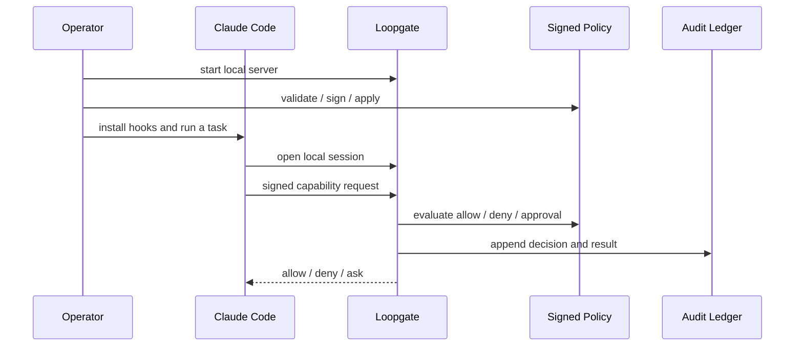

**Last updated:** 2026-04-16

# Getting Started

This is the shortest path to a real local Loopgate setup.

It assumes the current supported product shape:
- local-first
- single-user / local operator
- Claude Code hooks as the active harness
- signed policy
- local authoritative audit

## What you will do

1. build local binaries
2. initialize local policy signing
3. start Loopgate
4. install Claude Code hooks
5. run a normal task and inspect the local audit if needed

Prerequisites:
- Go 1.25 or newer to build from source
- Python 3 on `PATH`
- Claude Code

## Quick path

### 1. Build local binaries

```bash
make build
# optional: copy the binaries into ~/.local/bin
make install-local
```

If you ran `make install-local`, replace `./bin/...` below with the bare
command names such as `loopgate`, `loopgate-ledger`, and
`loopgate-policy-admin`.

### 2. Initialize local policy signing

```bash
./bin/loopgate init
./bin/loopgate-policy-admin validate
```

`loopgate init` creates a local Ed25519 signer for this operator, installs the
matching trust anchor under your Loopgate config directory, signs the checked-in
policy, and prints the `key_id` you should reuse later if you intentionally
re-sign with `loopgate-policy-sign`.

The checked-in starter policy is deliberately strict. If you want a more
permissive local-development baseline, review
[POLICY_REFERENCE.md](./POLICY_REFERENCE.md) and render a template with
`./bin/loopgate-policy-admin render-template` before signing and applying it.

### 3. Start Loopgate

Foreground:

```bash
./bin/loopgate
```

Simple background run from the repo root:

```bash
mkdir -p runtime/logs runtime/state
nohup ./bin/loopgate > runtime/logs/loopgate.stdout.log 2> runtime/logs/loopgate.stderr.log < /dev/null &
echo $! > runtime/state/loopgate.pid
```

Default socket:

```text
runtime/state/loopgate.sock
```

If you start Loopgate in the foreground from a terminal, that terminal session
owns the process. Closing the terminal usually stops Loopgate. Use `nohup`,
`launchctl`, or another service manager if you want it to stay up after the
shell exits.

Stop the `nohup` background process with:

```bash
kill "$(cat runtime/state/loopgate.pid)"
```

On the first successful start, Loopgate also bootstraps the default
Keychain-backed audit HMAC checkpoint key used for tamper-evident audit
checkpoints.
If macOS Keychain access is denied or canceled, Loopgate fails closed at
startup rather than falling back to plaintext or unaudited mode. Rerun from an
interactive login session and approve the Keychain prompt.
For keychain-backed operator flows, prefer the stable `./bin/...` binaries over
`go run`; a fresh `go run` build changes the executable identity and can cause
repeated macOS approval prompts.

### 4. Install Claude Code hooks

```bash
./bin/loopgate install-hooks
```

This updates:
- `~/.claude/settings.json`
- `~/.claude/hooks/`

The tracked hook bundle source lives in:
- `claude/hooks/scripts/`

Quick smoke check:
- run `/hooks` inside Claude Code and confirm the 7 Loopgate hook events are registered
- verify the installed commands point at `~/.claude/hooks/loopgate_*.py`

### 5. Run a normal task

Use Claude Code normally and watch for:
- low-risk reads that should be allow + audit
- higher-risk actions that should require approval
- hard denials that indicate policy or path issues

If you need quick visibility:

```bash
./bin/loopgate-ledger tail -verbose
./bin/loopgate-doctor report
```

## Optional contributor checkout validation

If you are validating a fresh source checkout rather than just installing
Loopgate for local use, also run:

```bash
go test ./...
```

## Normal local flow



## When things look wrong

- Hooks seem missing:
  - rerun `./bin/loopgate install-hooks`
  - confirm the tracked source bundle exists under `claude/hooks/scripts/`
- Policy changes are not taking effect:
  - rerun `validate`, `-verify-setup`, and `apply -verify-setup`
  - `-verify-setup` uses the current signed policy `key_id` by default
  - pass `-key-id` only if you intentionally want to verify or apply against a different signer than the current `core/policy/policy.yaml.sig`
- A task was denied and you want to know why:
  - `./bin/loopgate-ledger tail -verbose`
- You want a structured local diagnostic snapshot:
  - `./bin/loopgate-doctor report`

## Read next

- [Setup](./SETUP.md)
- [Operator guide](./OPERATOR_GUIDE.md)
- [Policy reference](./POLICY_REFERENCE.md)
- [Doctor and ledger tools](./DOCTOR_AND_LEDGER.md)
- [Loopgate HTTP API for local clients](./LOOPGATE_HTTP_API_FOR_LOCAL_CLIENTS.md)
